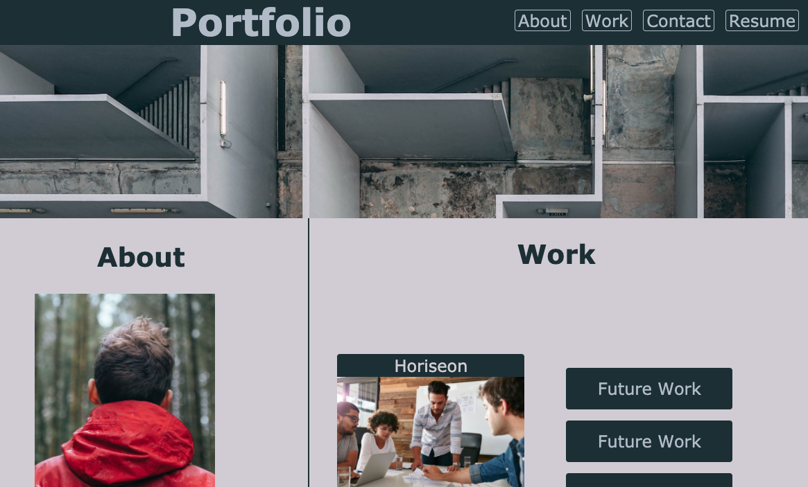

# portfolio_mcbrayer
## Profesional Portfolio

This project consisted of a ground up design, and build, using both html and css. After laying out a basic framework, time was spent utilizing various styling and layout tools to achieve the final product linked below. It is my intention to continue building out this portfolio as my skills evolve. 

## Motivation

A portfolio is an indispensable tool for both those seeking employment and, those employed alike. I've been told it takes several deployed projects to even recieve an initial interview at many companies. With that in mind, a sleek, functional, and stylish portfolio was the target I aimed for with this project. One that would not only display basic skills in the build, but would also provide a delivery means for more advanced projects down the road.

## Lessons Learned

This project was an intense excorsize in honing my knowledge and skills with both html and css. I made strides in my efficiency and work flow, and gained confidence with my use of tools such as media grabs and flexbox. Still, there is no doubt that I struggle with many aspects. I look forward to revisiting this project over the next few months for tune-ups, and filling out content with projects completed in the future. 

## Image of deployed application

## Links to application and repository

Repository - https://github.com/ihm57511/portfolio_mcbrayer

Live application - https://ihm57511.github.io/portfolio_mcbrayer/

### Credits

Much thanks to pexels.com and the artisits contributing to their free database of stock photos.

